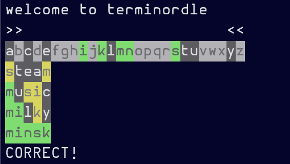

# terminordle

> multiplayer [wordle](https://www.powerlanguage.co.uk/wordle/) clone in your terminal



terminordle (pronounced "terminalordle") is inspired by the popular online game [wordle](https://www.powerlanguage.co.uk/wordle/) made for your terminal. You can play a pretty close replica of the original locally or multiplayer over the network.


<!-- vim-markdown-toc GFM -->

* [install](#install)
* [*PLAY*](#play)
  * [local single player](#local-single-player)
  * [remote multiplayer](#remote-multiplayer)
    * [new session](#new-session)
    * [join session](#join-session)
* [*SERVE*](#serve)
* [gameplay](#gameplay)
* [data privacy](#data-privacy)
  * [possible data collection exceptions](#possible-data-collection-exceptions)

<!-- vim-markdown-toc -->

## install

```bash
git clone https://github.com/HP4k1h5/terminordle.git
cd terminordle
yarn # or npm i
```

## *PLAY*

### local single player

from the `terminordle` directory

```bash
yarn play
```

### remote multiplayer

To start or join a multiplayer session you must know the address of a running terminordle server. See [serve](#serve). I currently have one running at 174.138.46.61:8080. If the server is up and not overloaded, you can use it for your multiplayer sessions, or you can host your own. See [data policy](#data-privacy) below.

The key command is `join`.

#### new session

To start a new session include only the address of the server

```bash
yarn join 174.138.46.61:8080
# If that server is overloaded try again later.
```

The server should respond with your user id and session name. These are both randomly chosen and cannot be changed. They are ephemeral.

> example response

```bash
welcome to terminordle
session id: session-name
user id: Yong
>>                      <<
abcdefghijklmnopqrstuvwxyz

```

The user id is chosen from the top one thousand most common names on Earth. The session-name is composed of two words chosen randomly from the word list. Share it with your friends and they can use it as [shown below](#join-session)

#### join session

If you know the two-word name of a session, you can use a command like the following to join that session, replacing "session-name" with the actual name of the session you wish you join. Someone will have to share this with you, or you will have to run the above command to generate a valid session id, and then share that with your friends.

```bash
yarn join 174.138.46.61:8080 -s session-name
```

## *SERVE*

Host your own terminordle server. The default host is 'localhost' and the default port is `8080`. See [data policy](#data-privacy) below.

The terminordle server is based on [WebSockets](https://developer.mozilla.org/en-US/docs/Web/API/WebSockets_API) and implements a standard [websockets/ws](https://github.com/websockets/ws) message broker. This server is implemented on a "trust-free" model and tries to restrict user interaction to the barest minimum necessary for multiplayer wordle play.

This means that there are no accounts or long-lived users at all and the players are essentially limited to broadcasting guesses to their session. There is currently no authorization since there is virtually no user data at all, and *nothing is being stored or tracked anywhere by this app*. See [data privacy](#data-privacy).

This application uses no external database and manages all user and session data in the node runtime memory. It currently limits concurrent connections to 1,000, and has other sensible settings for the WebSocketServer that restrict its memory and cpu footprint to (hopefully) the minimum necessary to serve hundreds of clients simultaneously. To be determined. Currently the security model of the app is to limit user input to session requests, join requests and guesses. That's all. Outgoing includes session metadata, guesses and error/info messages.

Client input is validated client side and again server side before being processed. The risk of injection exists, but the only user input that should be alba to be printed is a five letter a-zA-Z guess. This is checked against wordlists and other must meet other criteria limiting its ability to contain malicious strings. Please sumbit an issue or pr if you find security problems.

```bash
yarn serve
# change the port with
yarn serve 7357
```

## gameplay

Standard wordle rules mostly apply (mostly, submit an issue if there are discrepancies). Some deviations include the use of different sets of word lists, both for answers and guesses, more allowed guesses (currently 20), and multiplayer free-for-all mode.

The session is terminated on win or loss to free up server space. Play again if there is capacity.

## data privacy

This application makes no attempts to log or store or analyze any user data with the non-exclusive list of exceptions below. These exceptions should only apply if you are using the application in network (multiplayer) mode, and you are connecting to a server managed by [@HP4k1h5](https://github.com/HP4k1h5). In other cases, this software and its contributing authors make NO claims as to the reliability of service, or safety of connecting to any server, or the integrity of data privacy guarantees offered by those providers. Other servers may be running modified or corrupted versions of this software or may have other data privacy policies that are not in alignment with those expressed here.

### possible data collection exceptions

- hosting providers (e.g. digital ocean) may track and store your connection info, including ip addresses and other metadata associated with your connection. The server listed in the README is currently hosted by Digital Ocean (See [digital ocean privacy policies](https://www.digitalocean.com/legal/privacy-policy/)).

- in the course of operating the server, logging of various game related data (guesses, session_ids, etc) may occur and may be stored somewhere on a server for a limited time. This is used to debug the game, and should not include client metadata.

- the guesses themselves and their associated fully-pseudonymous guesser and session may, at some point, be logged and retained as a data source. This is not currently happening and every effort would be made to warn users of associated changes. Currently all names are pseudonyms and there are no accounts of any kind, and any attempt to collect or use this type of data would be fully anonymized and would contain only the slightest risk of bearing actual user data (i.e. in the event that someone could post a series of guesses that was undesirable from a privacy or security standpoint.
